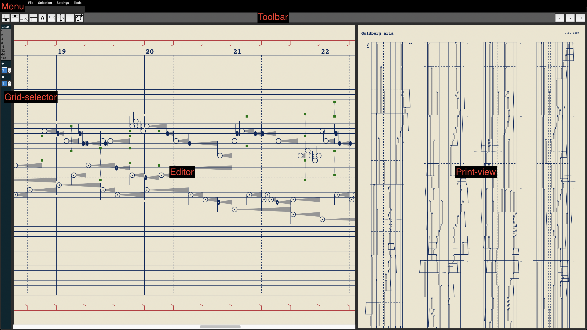

# PianoScript Manual

---

[toc]

---

## 1. At first usage

PianoScript is written for Windows MacOS and Linux. The different systems do have different ways to set everything up.
The app draws the music on a 'canvas'(digital paper) and can only export .postscript files(.ps). This means we have to setup a way to convert the postscript file to pdf in order to make the documents printable and easily shareable. Below the setup steps for the different systems:

### *MacOS*

* For MacOS you need the following command line programs: `pstopdf` and `pdfunite` (which is included in `poppler` package)
* Test if `pstopdf` exists on your system by typing `pstopdf` in the terminal. If you get usage information it exists and PianoScript can use it for pdf conversion.
* Usually `pdfunite` is not installed by default. Go to [https://brew.sh/](https://brew.sh/) and install homebrew if not already installed on your system. After installing homebrew enter `brew install poppler` to your terminal and hit enter.
* After a succesfull installation test if `pdfunite` is recognized as command if you enter this in the terminal.

If all works PianoScript should be able to successfully export the postscript and convert it to one single vector pdf file which you can then share or print.

### *Windows*

* For Windows we only need the command line program Ghostscript for the pdf conversion.
* Go to [https://www.ghostscript.com](https://www.ghostscript.com) and download Ghostscript (GNU Affero General Public License).
* After installing Ghostscript run PianoScript and try to export a pdf file. The app will ask for the ghostscript path and you need to select `gswin64c.exe` using a standard file dialog. Usually it's located at `C:/Program Files/gs/gs[currentversion]/bin/gswin64c.exe`.

The Ghostscript path is now saved in `~/Documents/PianoScript/.windows/.ghostpath`.

### *Linux*

* Everything Usually works out of the box because the command-line programs are on almost every Linux distribution installed by default.
* Type `ps2pdfwr` into the command line to check if it is installed.
* Type `pdfunite` into the command line to check if it is installed.

If everything is installed the pdf export should work.

---
This manual is assuming that you are already familiar with the PianoScript music notation. If not please read the tutorial at [pianoscript.org](http://www.pianoscript.org/tutorial.html)

## 2. Interface

There are four important areas:

### *Grid selector*

The cursor (blue vertical line in the editor) snaps on the grid division that you have selected in the grid-selector. In the listbox: 1=whole,2=Half,4=Quarter,8=Eight etc... Using the divide and multiply spinboxes below the listbox, you can form every possible rhythmic figure. For example you can select a quarter triplet length by selecting '4' in the listbox and '3' in the divide spinbox. Now you can draw a triplet since a quarter divided by three is a quarter triplet length.

### *Tool bar*

from left to right:

* *Right note input;* in this mode you can enter right hand notes by clicking the left mouse button. By click+drag you can edit the length of the note. The length will snap to the current selected grid in the grid-selector. While editing a note you edit only the length or the pitch. If you click+drag the mouse pointer before the start of the note, you can change the pitch; else you edit the note length.
- *Left note input;* Same as right note input but the stem points down and there is a dot inside the left hand note.
- *Line-break;* In line-break mode you can enter the points in time on which you want the music to 'break' the line and go to the next line. Ctl+click will run the add_quick_linebreak() function.
- *Count-line;* A count-line is used to highlight the sub-grid in case of notes that are way shorter then the base grid. Add by left clicking, edit the line on the green handles by left-click+drag, and delete by right-click on a green handle.
- *Text;* In Text mode we can add, edit and delete text. By left-click, you add a text on that position in time and pitch. The dialog has a text input where you enter your text and the option to put the text 'vertical in relation to staff'. So by default the text is printed in the direction of the staff but when the checkbox in the dialog is checked it will be printed vertically.
- *Slur;* [need to create]
- *Staff-Sizer;* A staff sizer is used to overwrite the automatic staff system. You can draw a range on a certain point in time and the staff will have this fixed size.
- *Repeat signs;* Left-click will add a start repeat, ctrl+left-click will add end repeat. Right-click on the repeat position will delete the repeat start and/or end.
- *previous page;* Turn the page from the print-view backwards. If on the first page you go to the last page.
- *next page;* Turn the page from the print-view forward. If on the last page you go to the first page.
- *horizontal/vertical;* This is a switch to switch between the vertical and horizontal engraving.

### *Editor* 

many is already told in the toolbar section of this document. However in this section I want to point out some general mechanics:

* *left-mouse-click* means **adding** or **editing**. 
* *right-mouse-click* means always **removing** the object. 
* this only works for the object from the currently selected mode(in the toolbar). 
* *shift+left-mouse-click+drag* will draw a rectangle which is used to make a **selection** of notes which you can then **cut**, **copy** or **paste**. When you use **paste**, the **selection** will be pasted on the **cursor position** indicated by the blue vertical lines at top and bottom in the **editor**.

### *Print-view* 

* in the print-view you can scroll over the page using the mouse-wheel.
* *left-mouse-click* on the print-view = previous page.
* *right-mouse-click* on the print-view = next page.
* resizing the print-view(by click+dragging the bar in between the print-view and the editor), will scale the drawing to fit the width of the print-view. You can also completely hide the print-view.

### *Menu*

The menu offers a lot of options, they are listed and explained:

* *File*; Only one file/project can be opened at once.

  * *New*; create a new file/project.
  * *Open*; open a file/project from your computer.
  * *Save*; save the current file/project. If the file is not yet saved earlier it jumps to save-as.
  * *Save as*; save the current file/project to a specified location on your computer.
  * [separator]
  * *Load midi*; import a midi-file into PianoScript. this will replace the entire opened file, therefore it asks if you want to save the current file.
  * [separator]
  * *Export ps*; export postscript files. There will be one postscript file for every page.
  * *Export pdf*; Export a pdf file.
  * *Export midi*; Export a midi-file.
  * [separator]
  * *Grid editor...*; will open the grid-editor.
  * [separator]
  * *Exit*; exit PianoScript.

* *Selection*; The selection menu is about operations that apply to the selection you made with the mouse(see the editor section).

  * *Cut*; cut the selection. Use this also to delete the selection.
  * *Copy*; copy the selection.
  * *Paste*; paste the copied or clipped memory.
  * [separator]
  * *Select all*; Select all notes in the project.

* *Settings*; in this menu you can edit all layout settings, titles, editor zoom and more...

  * *Title*; set the title for the document, this string will be printed at the top-left corner of the first page and in the footer of every page.
  * *Composer*;  set the composer name for the document, this string will be printed at the top-right corner of the first page and in the footer of every page.
  * *Copyright*; set the copyright notice for the document. this string will be printed in the footer on the bottom of every page.
  * [separator]
  * *Draw scale*; This is a powerful setting  that sets the global drawing scale of the document. Use it to change the global drawing size of the notation. *(on different systems the scaling has different results so the documents are not looking exactly the same across different systems)*
  * *Page width*; set the page width in mm.
  * *Page height*; set the page height in mm.
  * *Header height*; set the header height in mm. it's the space reserved for the title and composer text at the first page of the document.
  * *Footer height*; set the foorter height in mm. it's the space reserved for the footer text on each page.
  * *Page margin left*; set the left margin of every page in mm.
  * *Page margin right*; set the right margin of every page in mm.
  * *Page margin up*; set the top margin of every page in mm.
  * *Page margin down*; set the bottom margin of every page in mm.
  * *Color right hand midi-note*; set the greyscale color for every right hand note. choose a shade of grey that looks readable for your printer.
  * *Color left hand midi-note*; set the greyscale color for every left hand note. choose a shade of grey that looks readable for your printer.
  * [separator]
  * *Editor x zoom*; the amount of zoom in the x-axis in the editor. useful for editing smaller note values more easily.
  * *Editor y zoom*; you set the staff-height in the editor as a percentage of the editor height. So when set to 80(the default), the staff will use 80% of the total editor height.

* *Tools*; The tools menu stores different special functions that are time saving while composing or forming the document.

  * *Redraw editor*; This function is only there in case there is a bug in drawing the notes in the editor. Using this the editor will be reloaded/redrawn and everything will look normal again.
  * *Quantize*; quantize is used to quantize all notes in the file to a certain grid that is the current selected grid in the grid-selector. You can choose to quantize the note start positions or the note-stop positions. Just look what is the smallest note length value in your (for example imported midi) file and select that grid value.
  * *Add quick line-breaks*; this function is useful after importing a bigger midi-file. you can quickly add line-breaks by defining them in terms of measure-count. so inputting '4' will add line-breaks in groups of four measures while '2 6 4' will group the first line into two, second into 6 and the third to the last line will be grouped into groups of four again.
  * *Transpose*; You can transpose by entering the start-measure end end-measure to make a selection. the third value id your transpose value. So '1 5 3' will transpose every note from the **start of bar one** to **the end of bar five**, **three** semitones **up**. '0 0 -12' will select the whole file and transpose it one octave down.

  

